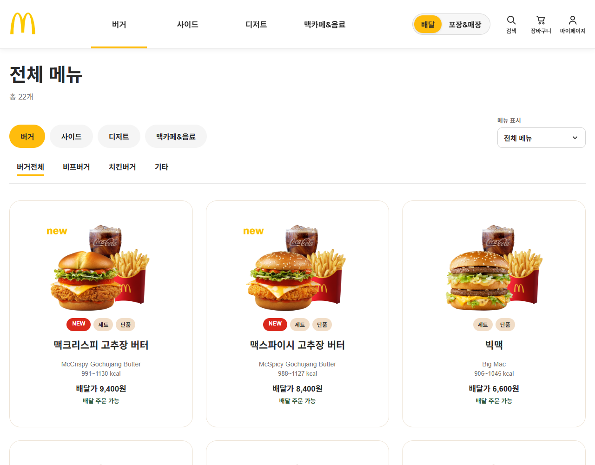
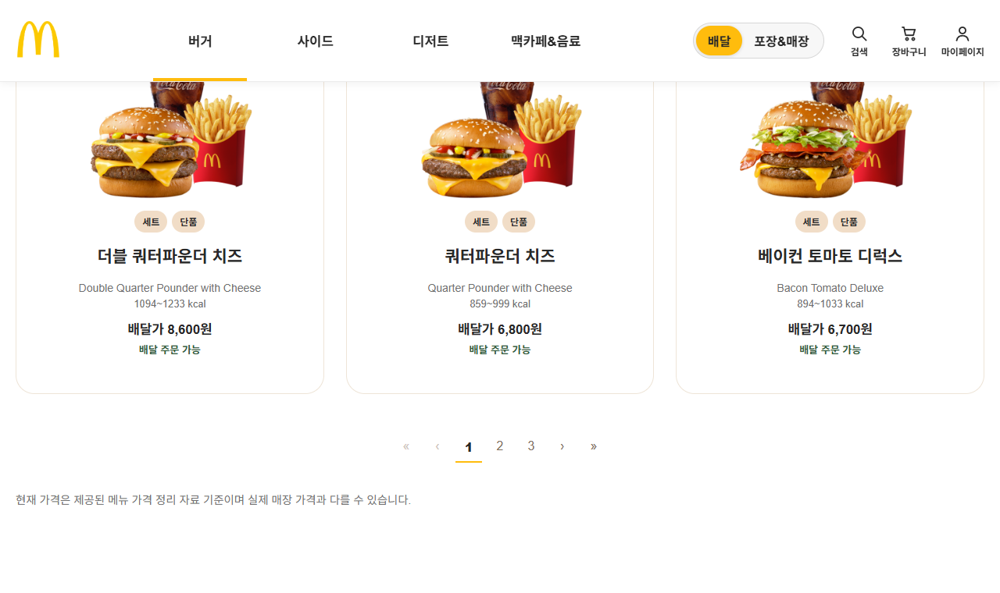
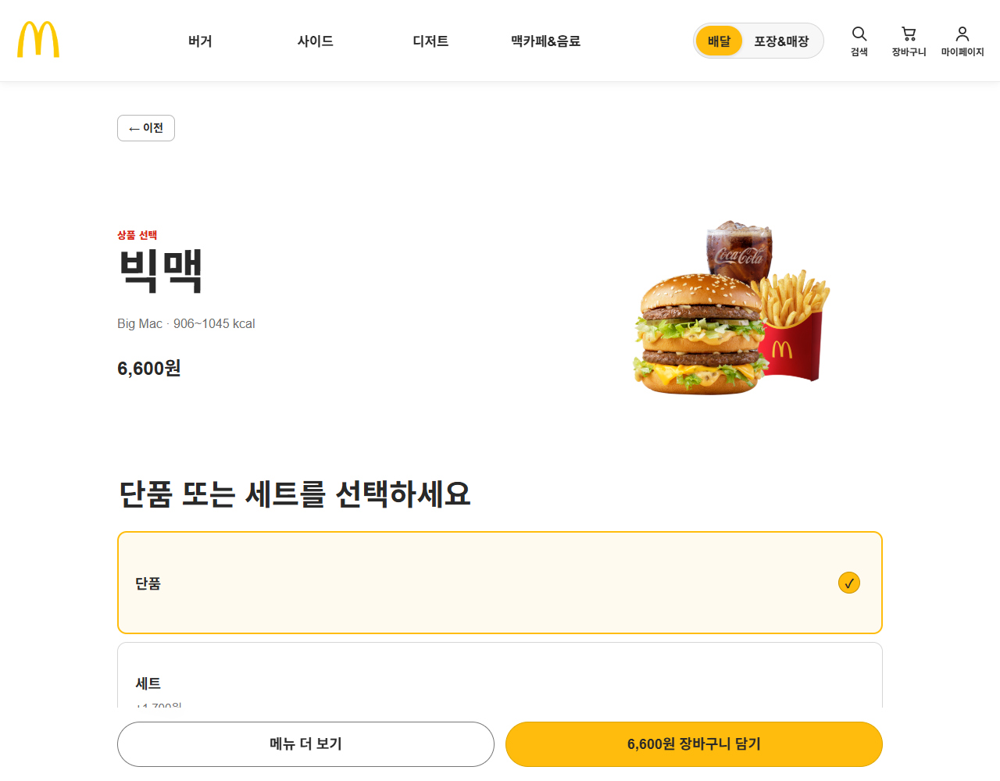
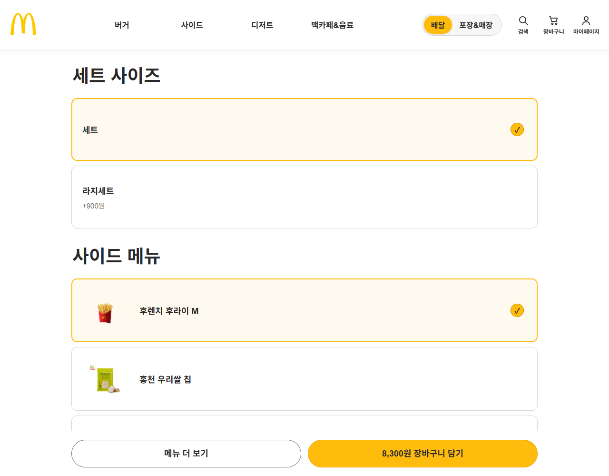
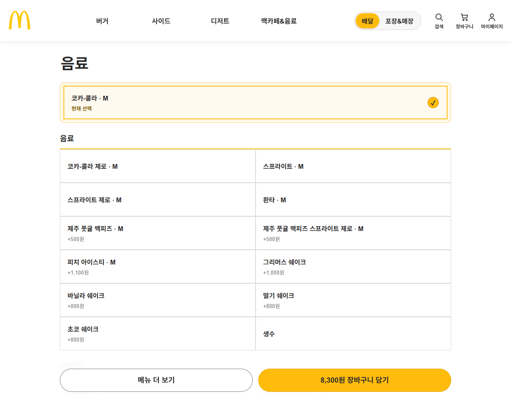
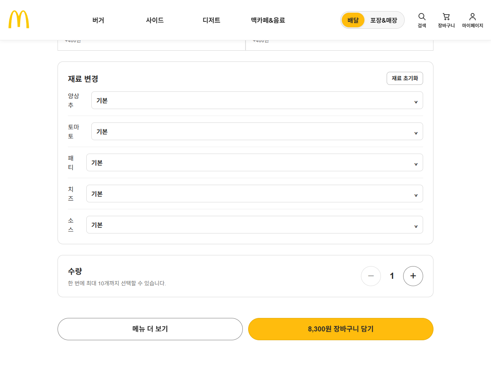

# 🍔 맥도날드 통합 주문 웹 (McDonald's Order Web)

메뉴 탐색부터 옵션 선택, 장바구니, 모의 결제, 주문 내역 확인까지 하나의 흐름으로 구현한 **React 기반 패스트푸드 모의 주문 웹**입니다.
배달 / 포장&매장 두 가지 주문 방식을 지원하며, 두 방식 모두 매장 선택 과정을 포함합니다.

> 공식 맥도날드 주문 시스템과 연결되지 않는 **비상업적 교육용 프로젝트**입니다.
> 메뉴·가격·매장 정보는 mock 데이터이며, 실제 결제나 주문 전송은 이루어지지 않습니다.

## 👥 팀원

강필준 · 김승우 · 김상준 · 김도현 · 이동희

## 🙋 담당 업무

- **기획**: 리액트 프로젝트 주제로 '맥도날드 주문 웹' 아이디어를 제안해 채택되었습니다.
- **메인 페이지(메뉴 목록)**: `MenuListPage`, `MenuCard`, `Pagination`
- **메뉴 상세 페이지**: 메뉴 클릭 시 보이는 화면 전체
  - `MenuDetailPage`, `ProductVisual`, `OptionSelector`, `SelectDropdown`, `DrinkOptionSelector`, `QuantityInput`, `Button`, `SecondaryActionButton`
- **장바구니 연결**: 선택한 옵션으로 장바구니에 담고 장바구니 화면으로 이동하는 흐름

### 메뉴 목록

카테고리별 메뉴를 카드(`MenuCard`)로 보여주고, 한 페이지에 9개씩 페이지 번호(`Pagination`)로 이동합니다.

| 메뉴 카드 목록 | 페이지 이동 |
|---|---|
|  |  |

### 메뉴 상세 · 옵션 선택

단품/세트를 고르면 세트 사이즈, 사이드, 음료 선택지가 나타나고, 선택에 따라 하단 **장바구니 담기** 버튼의 금액이 바로 바뀝니다.

| 상품 정보 · 단품/세트 선택 | 세트 사이즈 · 사이드 |
|---|---|
|  |  |

| 음료 선택 | 재료 변경 · 수량 · 장바구니 담기 |
|---|---|
|  |  |

## 🛠 기술 스택

| 구분 | 사용 기술 |
|---|---|
| Frontend | React 19, React Router 7 |
| Build | Vite |
| Language | JavaScript (JSX), CSS |
| 상태 관리 | Context API + Custom Hook |
| 데이터 저장 | localStorage |
| 코드 품질 | ESLint |

TypeScript와 UI 라이브러리(Tailwind, Bootstrap, MUI 등) 없이 순수 JSX와 직접 작성한 CSS로 구현했습니다.

## ✨ 전체 기능

- **메뉴 탐색**: 대분류·소분류 카테고리 필터, 메뉴 검색, 페이지네이션
- **주문 방식 선택**: 배달 / 포장&매장 전환, 매장(지점) 선택
- **상품 상세**: 단품·세트 전환, 세트 크기, 사이드·음료 선택, 재료 변경
- **가격 계산**: 옵션 추가금과 수량을 반영한 실시간 금액 표시
- **장바구니**: 담기, 수량 변경, 삭제, 브라우저 재접속 시 복원
- **주문서**: 배달 정보 입력, 포장/매장 식사 선택, 일회용품 여부, 결제수단 선택
- **주문 완료**: 주문 번호와 대기번호 발급
- **마이페이지**: 주문 내역, 결제수단, 프로필 확인

## 🗺 주요 화면 경로

| 경로 | 화면 |
|---|---|
| `/menus` | 메뉴 목록 |
| `/menus/:menuId` | 메뉴 상세 |
| `/cart` | 장바구니 |
| `/checkout` | 주문서 |
| `/order-complete/:orderId` | 주문 완료 |
| `/mypage` | 마이페이지 |

## 📁 폴더 구조

```
├── 요구_분석서.docx                 # 프로젝트 주제 및 요구사항
├── 기능명세서.docx                  # 기능 목록 및 상세 명세
├── 화면_정의_목록서.docx             # 화면 목록
├── 맥도날드_주문웹_와이어프레임.docx
├── 데이터정의서.docx                 # mock 데이터 구조
├── 테스트_체크리스트.docx
├── 6단계_작업규칙.docx               # 코딩 규칙 및 폴더 역할
├── screenshots/                     # README 화면 캡처
└── frontend/                        # React 프로젝트
    ├── public/images/               # 로고, 메뉴 이미지
    ├── scripts/                     # 메뉴 이미지 동기화 스크립트
    └── src/
        ├── pages/                   # 라우트 단위 화면
        ├── components/              # layout(Header 등), common(공통 UI)
        ├── context/                 # 장바구니·주문 전역 상태
        ├── hooks/                   # useStore
        ├── data/                    # 메뉴·매장·카테고리 mock 데이터
        ├── storage/                 # localStorage 읽기/쓰기
        ├── utils/                   # 가격 계산, 검증 등 순수 함수
        ├── constants/               # 공통 규칙
        └── styles/                  # CSS 변수, 전역 스타일
```

## 🚀 실행 방법

```bash
cd frontend
npm install
npm run dev
```

브라우저에서 `http://localhost:5173` 으로 접속합니다.

## 📄 기획 문서

요구 분석 → 기능 명세 → 화면 정의 → 와이어프레임 → 데이터 정의 → 테스트 순서로 문서를 작성하고, 요구사항 번호(R-xx)와 기능 번호(F-xx)를 연결해 구현과 테스트를 진행했습니다.
